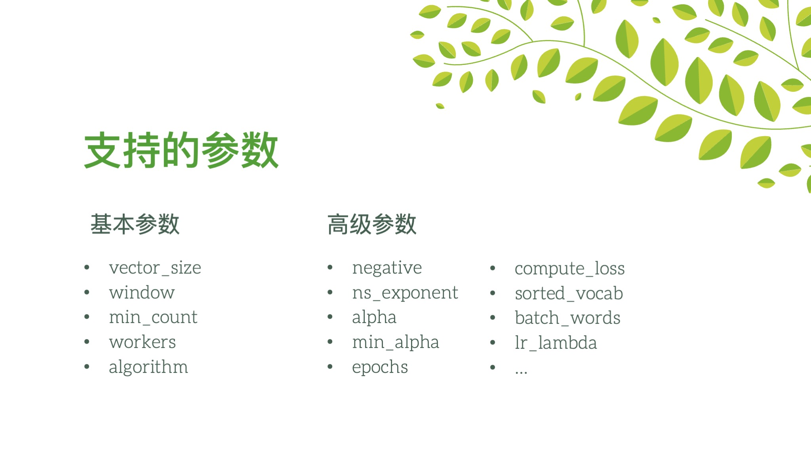
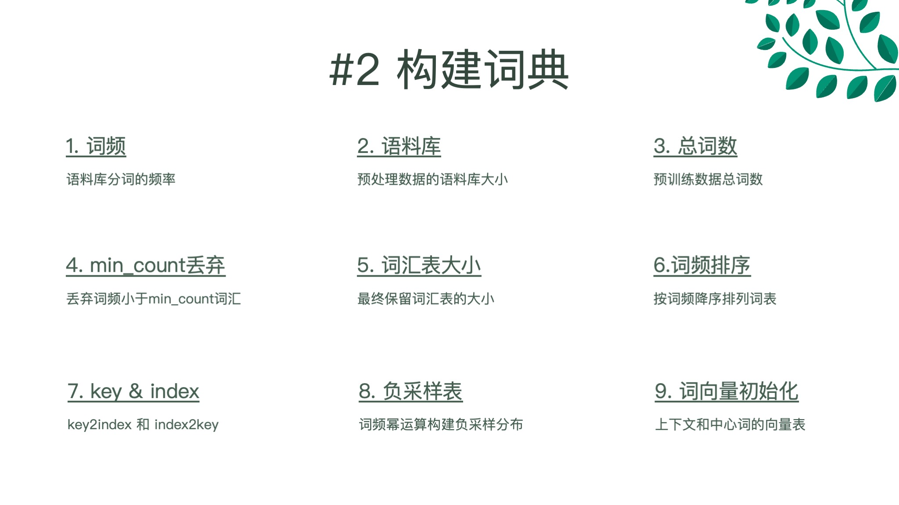
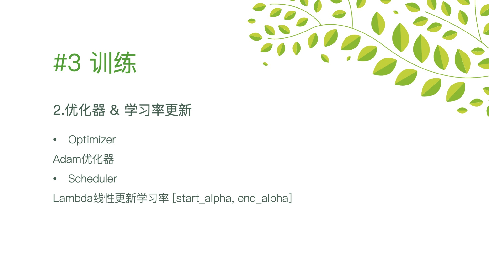
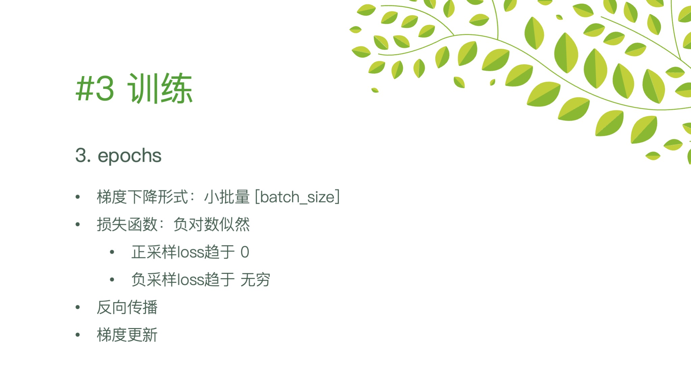
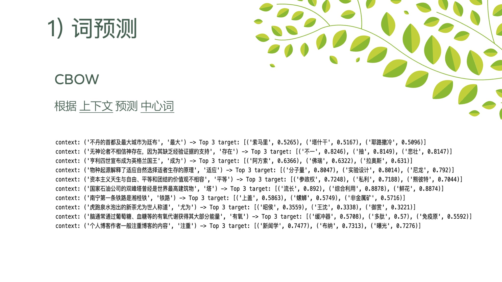
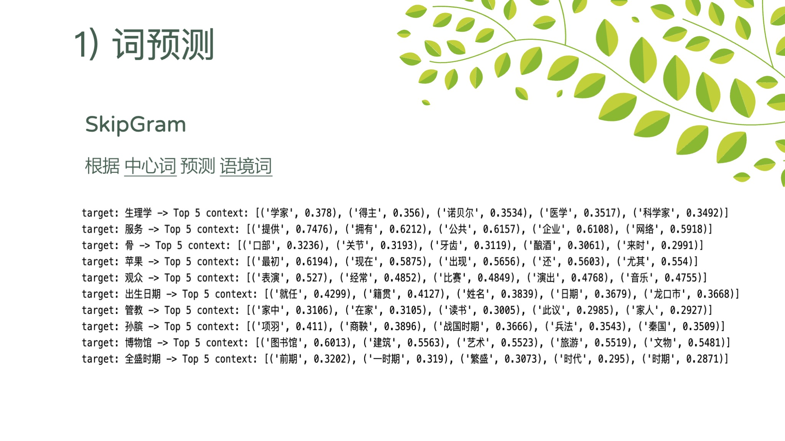
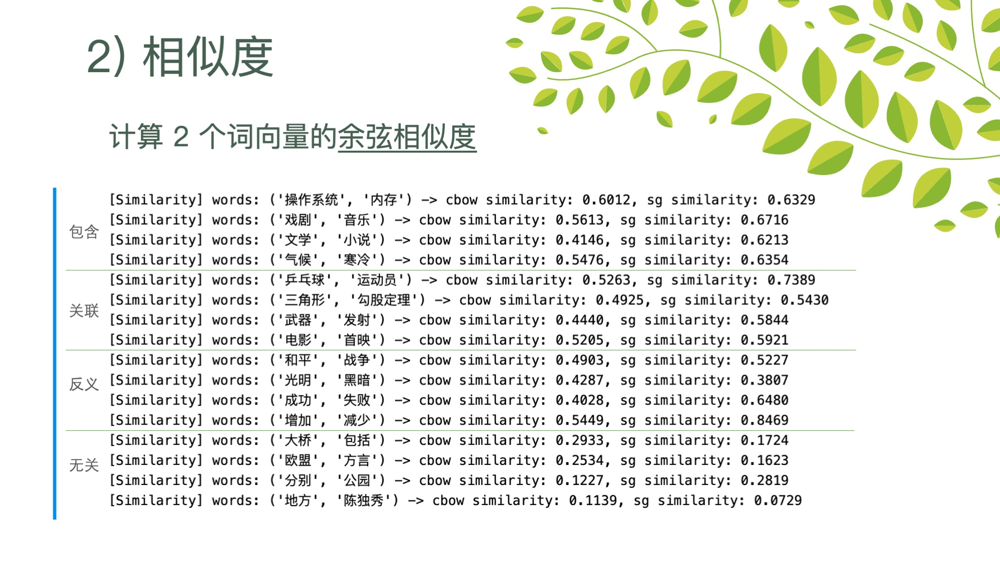
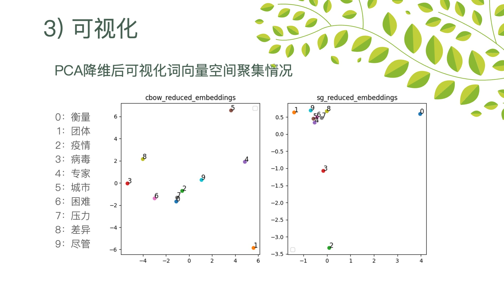

# nlp_2024
自然语言处理

## BBA (Baby Broca's Area) / word2vec 词向量

布罗卡区（Broca's area）是大脑中一个重要的区域，主要负责语言信息的处理和话语的产生。

婴儿的布罗卡区发育过程正如词向量构建的过程，产生、处理、控制。

### 1. 基本参数
| 参数          | 描述                                                                                   | 默认值 | gensim | BBA  |
|---------------|----------------------------------------------------------------------------------------|--------|------|------|
| sentences     | 训练数据，可以是一个列表，包含多个句子，每个句子是一个词的列表。也可以是一个可迭代对象。 | -      | ✓   | ✓    |
| vector_size   | 生成的词向量的维度。                                                                   | 100    | ✓   | ✓    |
| window        | 上下文窗口的大小，表示当前词语前后可以看多远的词。                                     | 5      | ✓   | ✓    |
| min_count     | 忽略所有频率低于此值的词。                                                             | 5      | ✓   | ✓    |
| workers       | 并行训练时使用的线程数。                                                               | 1      | ✓   | ✓    |
| algorithm/sg            | 训练算法的选择，0 表示 CBOW，1 表示 Skip-gram。                                        | 0      | ✓   | ✓    |

### 2. 高级参数
| 参数          | 描述                                                                                   | 默认值 | gensim | BBA  |
|---------------|----------------------------------------------------------------------------------------|--------|------|------|
| hs            | 如果为 1，则使用层次 Softmax；如果为 0，则使用负采样。                                 | 0      | ✓   | -    |
| negative      | 如果 > 0，则使用负采样，负采样的个数。                                                 | 5      | ✓   | ✓    |
| ns_exponent   | 负采样分布的指数值。1.0 表示与 unigram 分布相同，0.0 表示所有词的频率相同。              | 0.75   | ✓   | ✓    |
| cbow_mean     | 如果为 1，则使用上下文词向量的均值；如果为 0，则使用总和。仅在 CBOW 模式下使用。         | 1      | ✓   | ✓    |
| alpha         | 初始学习率。                                                                           | 0.010  | ✓   | ✓    |
| min_alpha     | 训练过程中线性衰减到的最小学习率。                                                     | 0.001 | ✓   | ✓    |
| epochs        | 训练语料库的迭代次数。                                                                 | 5      | ✓   | ✓    |
| compute_loss  | 如果为 True，则计算并存储训练期间的损失值。                                             | False  | ✓   | ✓    |
| seed          | 随机数生成器的种子。                                                                   | 1      | ✓   | -    |
| max_vocab_size| 构建词汇表时的内存限制（以字节为单位）。                                                | None   | ✓   | -    |
| sample        | 高频词的下采样阈值。                                                                   | 1e-3   | ✓   | -    |
| sorted_vocab  | 如果为 True，则在构建词汇表时按词频排序。                                                  | True      | ✓   | ✓    |
| batch_words   | 每个工作线程的批处理大小。                                                             | 256  | ✓   | ✓    |
| trim_rule     | 指定自定义词汇表修剪规则的函数。                                                       | None   | ✓   | -    |
| callbacks         | 在训练过程中调用的回调函数列表。                                                       | None   | ✓   | -    |
| max_final_vocab   | 限制最终词汇表的大小。                                                                 | None   | ✓   | -    |
| shrink_windows    | 如果为 True，则在训练过程中逐渐减小窗口大小。                                           | False  | ✓   | -    |

> #### 设计参考 
> **gensim.models.Word2Vec** 是一个用于训练和使用 Word2Vec 模型的类。Word2Vec 是一种将词语映射到向量空间的技术，可以捕捉词语之间的语义关系。

### 展示

